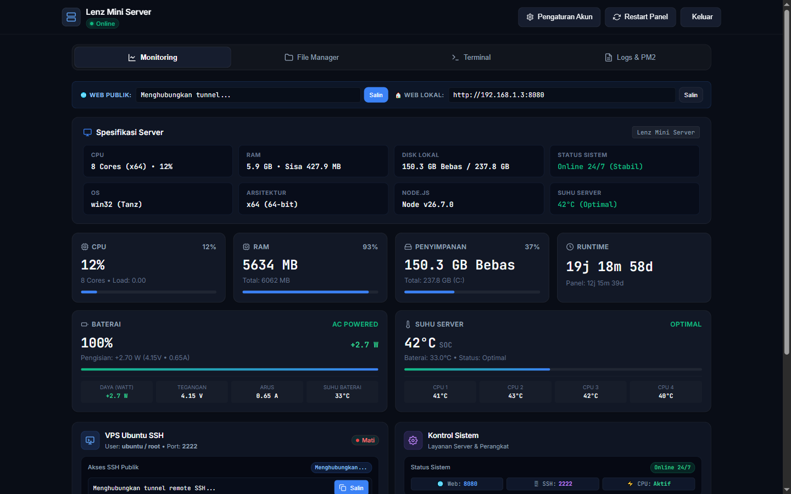
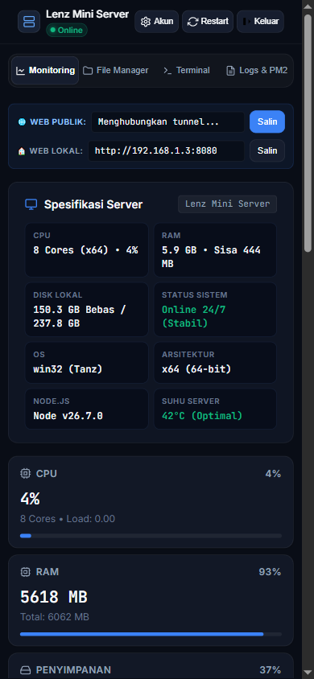
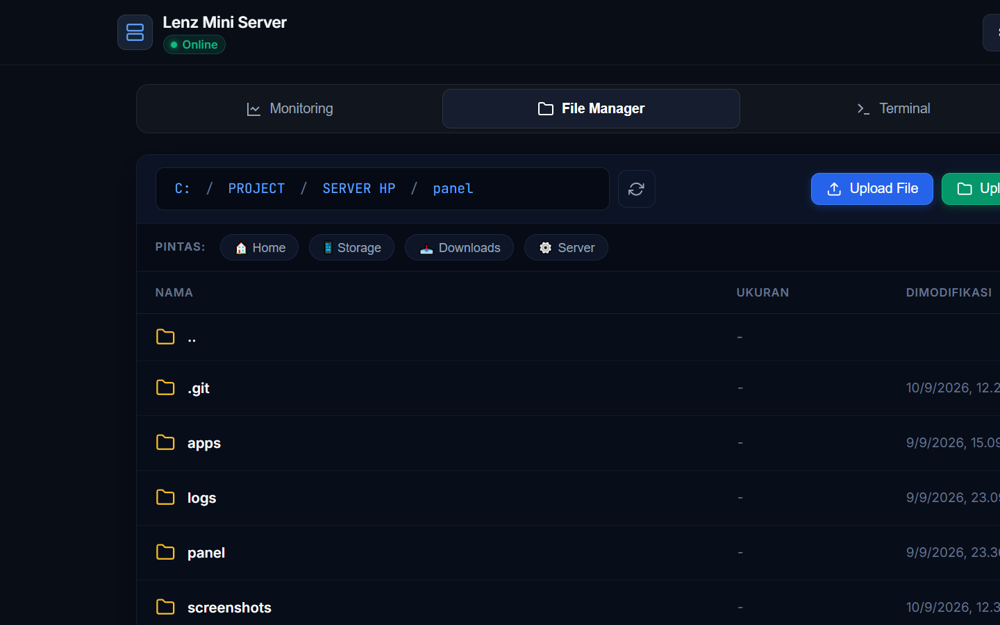
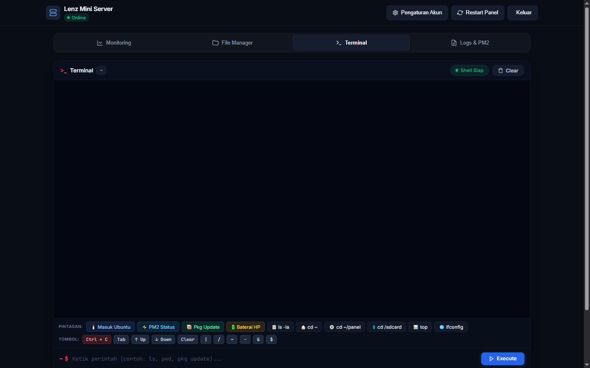
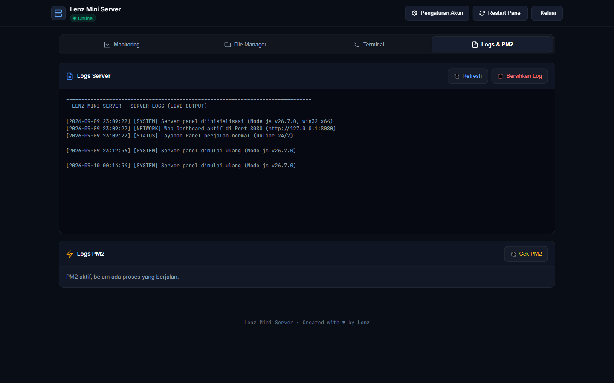

# Lenz Mini Server & Ubuntu VPS (Termux Universal Edition)

Transformasikan smartphone Android lama atau baru (Android 5.0 s/d 14+, arsitektur ARM32/ARM64/x86_64) menjadi **Mini Server & Distro Linux Ubuntu VPS** berfitur lengkap yang dapat dikendalikan penuh secara lokal maupun jarak jauh melalui Web Dashboard modern.

---

## 🌟 Fitur Utama Server

* 🌐 **Web Dashboard Modern (Port 8080)**
  * Antarmuka web gelap (*dark mode*) yang responsif di layar HP, tablet, maupun laptop/PC.
  * Autentikasi sesi aman dengan proteksi *anti-brute force*.
* 📊 **Monitoring Sistem Real-Time**
  * Pantau penggunaan CPU %, RAM (MB/%), Kapasitas Penyimpanan Disk, Uptime, Baterai, dan Sensor Suhu SoC & Core CPU secara *live*.
* 📁 **Web File Manager Lengkap**
  * Jelajahi direktori Termux (`~`) dan penyimpanan internal Android (`/sdcard`).
  * Upload file & folder, unduh file/folder (otomatis ZIP), buat file/folder, ubah nama, hapus, ekstrak ZIP, serta text editor built-in.
* 💻 **Web Terminal / Bash Console**
  * Jalankan perintah Linux/Termux langsung dari browser dengan *live chunk streaming*, riwayat perintah (*arrow up/down*), dan dukungan interupsi **Ctrl + C**.
* 📋 **Manajer Log & PM2 Process Manager**
  * Pantau dan kelola proses Node.js di PM2 (Start, Stop, Restart, Cek Log) serta pantau live log server panel.
* 🖥️ **Ubuntu Linux VPS (PRoot + OpenSSH Port 2222)**
  * Distro Linux Ubuntu asli di dalam Android tanpa perlu root.
  * Dilengkapi OpenSSH Server aktif di port `2222` dan CLI helper tools bawaan (`vps-fix`, `vps-install`, `termux-fix`, `termux-install`).
* 🌍 **Akses Publik Bebas Blokir (Cloudflare Tunnel)**
  * Dilengkapi tunnel otomatis agar dashboard dan SSH dapat diakses dari luar jaringan (data seluler/luar kota) tanpa perlu IP publik statis atau port forwarding modem.

---

## 📸 Preview Tampilan Web Dashboard

| 📊 Dashboard (Dekstop) | 📱 Tampilan Mobile |
| :---: | :---: |
|  |  |

| 📁 Web File Manager | 💻 Web Terminal & Console |
| :---: | :---: |
|  |  |

| 📋 Server Logs |
| :---: |
|  |

---

## 📋 Spesifikasi Minimal & Penggunaan Sumber Daya

### 1. Spesifikasi Perangkat Minimal (Hardware & OS)
| Komponen | Spesifikasi Minimal | Rekomendasi Ideal |
| :--- | :--- | :--- |
| **Sistem Operasi** | Android 5.0 (Lollipop / SDK 21) | Android 7.0 s/d 14+ |
| **Arsitektur CPU** | ARM32 (`armhf`) / x86 | ARM64 (`aarch64`) / x86_64 |
| **RAM Fisik HP** | **512 MB** | **1 GB – 2 GB+** |
| **Penyimpanan Internal Bebas** | Minimal **1.5 GB** | **3 GB+** (ruang untuk file upload & app) |
| **Status Root** | **Tanpa Root (Non-Root)** | Non-Root (didukung juga untuk HP Root) |

### 2. Estimasi Penggunaan RAM & Penyimpanan (Resource Consumption)
* 🧠 **Penggunaan RAM (Idle)**:
  * **Web Dashboard Panel (Node.js murni)**: ~25 – 45 MB RAM
  * **Ubuntu VPS (PRoot + OpenSSH `sshd`)**: ~25 – 40 MB RAM
  * **Total RAM Aktif**: **~60 – 100 MB RAM** *(Sangat hemat daya baterai & ringan)*
* 💾 **Penggunaan Ruang Penyimpanan**:
  * **Paket Termux Host** (*Node.js, PM2, OpenSSH, Python, FFmpeg, ImageMagick, PRoot*): ~500 MB – 1 GB
  * **Ubuntu Linux VPS Full** (*Rootfs, GCC/G++ Compiler `build-essential`, Python3, FFmpeg, ImageMagick, SSH Server*): ~1.5 GB – 2.5 GB
  * **Total Penyimpanan Bersih**: **~2 GB – 3.5 GB** *(Bisa hingga 5 GB jika cache unduhan `.deb` belum dibersihkan)*
  * 💡 *Tips Hemat Penyimpanan*: Jalankan `pkg clean` di Termux dan `vps-fix` atau `apt-get clean` di Ubuntu VPS untuk menghapus sisa cache installer.

---

## 📱 Rekomendasi Versi Termux Sesuai Versi Android

Installer otomatis mendeteksi versi Android dan arsitektur CPU perangkat Anda. Agar instalasi berjalan lancar, gunakan versi Termux yang sesuai:

| Versi Android | Rekomendasi Aplikasi Termux | Tautan Unduh |
| :--- | :--- | :--- |
| **Android 5.0 & 6.0** *(Legacy / 32-bit)* | Termux **v0.119.0-beta.3** varian **`apt-android-5`** (`armeabi-v7a` atau `universal`) | [GitHub Releases v0.119.0-beta.3](https://github.com/termux/termux-app/releases/tag/v0.119.0-beta.3) |
| **Android 7.0 s/d 14+** *(Modern / 64-bit)* | Termux versi terbaru dari **F-Droid** atau GitHub Releases resmi | [F-Droid Termux](https://f-droid.org/packages/com.termux/) / [GitHub Releases](https://github.com/termux/termux-app/releases) |

> ⚠️ **Catatan Penting**: Jangan gunakan aplikasi Termux dari Google Play Store karena sudah tidak diperbarui dan repositorinya tidak berfungsi.

---

## 🚀 Panduan Instalasi (Langkah demi Langkah)

### Langkah 1: Persiapan Aplikasi di HP
1. Pasang aplikasi **Termux** yang sesuai dengan versi Android HP Anda.
2. *(Opsional)* Pasang juga **Termux:Boot** dari halaman rilis yang sama agar server otomatis menyala saat HP direstart.

### Langkah 2: Eksekusi Instalasi Otomatis
Buka aplikasi **Termux**, lalu jalankan:
```bash
pkg update -y && pkg install git -y
git clone https://github.com/Lenzx999/LenzNode.git
cd LenzNode
bash install.sh
```

#### Proses yang Dijalankan `install.sh` Secara Otomatis:
1. Mengaktifkan `termux-wake-lock` agar CPU HP tidak tidur saat layar mati.
2. Memasang paket Termux: `nodejs`, `pm2`, `python`, `openssh`, `ffmpeg`, `libwebp`, `proot`, `curl`, `wget`, `zip`, `unzip`.
3. Mengunduh dan mengonfigurasi Rootfs Linux Ubuntu sesuai arsitektur CPU perangkat (`armhf`, `arm64`, atau `amd64`).
4. Menyiapkan OpenSSH Server Ubuntu di port `2222`.
5. Memasang skrip autostart dan langsung meluncurkan server.

---

## 🌐 Cara Mengakses Website & VPS

Setelah instalasi selesai dan server dijalankan (`bash ~/LenzNode/start.sh` atau `lenz-server`), berikut panduan lengkap untuk mengakses Web Dashboard dan Ubuntu VPS.

---

### 1. 🌐 Cara Mengakses Web Dashboard (Website)

Web Dashboard berfungsi sebagai pusat kendali visual untuk memantau sistem, mengelola file, terminal web, dan proses server.

#### A. Akses Jaringan Lokal (Wi-Fi yang Sama)
Pastikan perangkat Anda (Laptop / PC / HP lain) terhubung ke **satu jaringan Wi-Fi / Hotspot yang sama** dengan HP Server.
1. Buka browser (Chrome, Firefox, Edge, Safari, dll).
2. Kunjungi alamat:
   ```text
   http://<IP-HP>:8080
   ```
   *(Contoh: `http://192.168.1.15:8080`)*

#### B. Akses Jarak Jauh / Publik (Cloudflare Tunnel)
Jika Cloudflare Tunnel aktif, Anda dapat mengakses dashboard dari mana saja (tanpa perlu satu Wi-Fi):
* Gunakan URL publik HTTPS yang muncul di terminal Termux saat server dijalankan *(contoh: `https://xxx-xxx-xxx.trycloudflare.com`)*.

#### 🔑 Kredensial Login Web Dashboard:
* **Username**: `admin`
* **Password**: `admin123`
*(Password dapat diubah kapan saja melalui menu **Pengaturan Akun** di dashboard)*

---

### 2. 🖥️ Cara Mengakses Ubuntu VPS

Ubuntu VPS berjalan di background Android dan menyediakan lingkungan Linux lengkap dengan OpenSSH.

#### A. Masuk Langsung dari HP Server (Aplikasi Termux)
Cukup buka aplikasi **Termux** di HP server, lalu ketik salah satu perintah berikut:
```bash
ubuntu
# atau
lenz-vps
```
Anda akan langsung masuk ke terminal root Ubuntu (`root@localhost:~#`).

#### B. Akses via SSH dari Laptop / PC / HP Lain (Satu Wi-Fi)
Buka Terminal (macOS/Linux) atau Command Prompt / PowerShell (Windows) di laptop Anda, lalu jalankan:
```bash
# Login sebagai root:
ssh root@<IP-HP> -p 2222

# Atau login sebagai user biasa (ubuntu):
ssh ubuntu@<IP-HP> -p 2222
```
* **Port**: `2222`
* **Password**: `ubuntu123`

#### C. Akses via Aplikasi SSH Client (PuTTY, Termius, JuiceSSH)
Jika menggunakan aplikasi SSH GUI, masukkan parameter berikut:
* **Host / IP Address**: `<IP-HP>` *(contoh: `192.168.1.15`)*
* **Port**: `2222`
* **Username**: `root` atau `ubuntu`
* **Password**: `ubuntu123`

---

### 📋 Tabel Ringkasan Akses & Port

| Layanan | Protokol / Port | Alamat / Perintah Akses | Kredensial Default |
| :--- | :--- | :--- | :--- |
| **Web Dashboard** | HTTP / `8080` | `http://<IP-HP>:8080` *(atau URL Cloudflare)* | `admin` / `admin123` |
| **Ubuntu VPS (SSH)** | SSH / `2222` | `ssh root@<IP-HP> -p 2222` | `root` (atau `ubuntu`) / `ubuntu123` |
| **Ubuntu VPS (Lokal)** | Internal | Ketik: `ubuntu` di Termux | Langsung login root |

> 💡 **Tips Mengetahui IP HP**: Alamat IP lokal HP dan link publik Cloudflare akan ditampilkan secara otomatis di log terminal Termux saat `start.sh` dijalankan. Anda juga bisa mengecek IP HP di menu **Pengaturan Wi-Fi** perangkat.

---

## ⚙️ Perintah Kontrol Server (`start.sh`)

Gunakan script `start.sh` di Termux untuk mengelola layanan:

* **Menjalankan Server**:
  ```bash
  bash ~/LenzNode/start.sh
  ```
* **Melihat Status Layanan**:
  ```bash
  bash ~/LenzNode/start.sh status
  ```
* **Mematikan Server**:
  ```bash
  bash ~/LenzNode/start.sh stop
  ```
* **Memulai Ulang (Restart)**:
  ```bash
  bash ~/LenzNode/start.sh restart
  ```

---

## 🔄 Cara Update ke Versi Terbaru

Cukup jalankan perintah 1 baris ini di **Terminal Web Dashboard** atau di aplikasi **Termux**:

```bash
curl -sL https://raw.githubusercontent.com/Lenzx999/LenzNode/main/update.sh | bash
```

> 💡 *Di aplikasi Termux, Anda juga bisa langsung mengetik perintah singkat `lenz-update`.*

---

## 🛠️ CLI Helper Tools & Perintah Cepat

### Di Termux Host
* `lenz-update` : Memperbarui server ke versi terbaru dari GitHub secara otomatis.
* `lenz-server` : Menjalankan atau merestart seluruh layanan Lenz Mini Server & VPS.
* `lenz-vps`    : Masuk langsung ke sesi interaktif Ubuntu Linux VPS.
* `lenz-status` : Menampilkan status operasional port panel (8080) dan SSH (2222).
* `lenz-stop`   : Menghentikan seluruh proses server dan VPS.
* `termux-fix`  : Memperbaiki package manager dpkg di Termux host.

### Di Terminal Ubuntu VPS
* `panel-status` : Menampilkan ringkasan penggunaan CPU, RAM, Suhu, Baterai, dan link website secara instan.
* `panel-restart`: Mengirim sinyal restart ke panel server dari dalam VPS.
* `vps-install <nama-paket>`: Memasang paket apt di Ubuntu dengan mekanisme auto-fix jika terjadi dependensi error.
* `vps-fix`    : Membersihkan file lock dpkg/apt dan memperbaiki konfigurasi paket rusak.

---

## ❄️ Tips Menjaga Suhu & Stabilitas Operasional 24/7

Jika HP digunakan sebagai server non-stop:

1. **Kunci Aplikasi di Pengaturan Manajemen Daya Android**:
   * Buka Pengaturan Baterai / iManager HP -> Izinkan konsumsi daya latar belakang tinggi untuk **Termux**.
   * Nonaktifkan fitur *Auto-Sleep* / Penghemat Baterai Ekstrem.
2. **Setelan Kebijakan Wi-Fi**:
   * Pengaturan Wi-Fi HP -> Lanjutan -> Atur **Keep Wi-Fi on during sleep** ke **Always**.
3. **Pencegahan Suhu Panas (Overheat)**:
   * Lepas casing/pelindung HP agar panas bodi mudah terbuang.
   * Gunakan kipas pendingin mini USB (fan 5V) yang mengarah langsung ke bodi belakang HP.
   * Gunakan charger dengan daya stabil untuk menjaga kesehatan baterai.

---

## 👤 Author & Lisensi

* **Author / Developer**: **Lenz**
* **Project**: Lenz Mini Server & Ubuntu VPS
* **Lisensi**: MIT License

